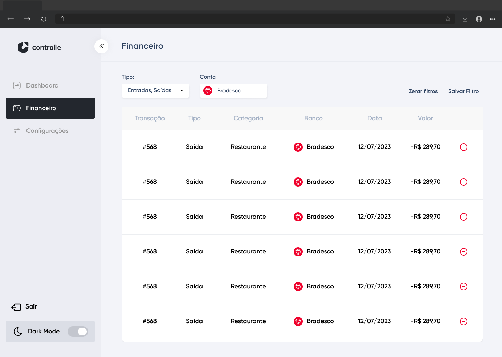

# SOBRE O PROJETO
Este repositório replica um sistema de gerenciamento financeiro pessoal, e foi desenvolvido em React e TS.
O mockup utilizado foi criado no Figma pela desenvolvedora, os dados foram armazenados em um servidor falso em JS.

Toda a estilização foi feita utilizando Styled-components.

A tabela possui 3 tipos de filtros: Tipo de dado (Entrada/Saída), Conta bancária e Forma de Pagamento.
Todos os filtros são armazenados no React Reducer.

### OBS.: A interface foi feita para desktop, não sendo responsiva.

## MOCKUP

## REQUISITOS
React = ^18.2.0, 
Typescript = ^4.9.5
Node = foi utilizado o 18.16.1

## LINGUAGEM, FRAMEWORK E BIBLIOTECA
#### Linguagem: Typescript
#### Biblioteca Principal: React

### BIBLIOTECAS
#### Estilização: Styled-components
#### Componentes de filtros: react-menu e downshift
#### Tabela: react-data-table-component

## COMO INICIAR
### OBS.: CERTIFIQUE-SE DE UTILIZAR O NODE 18.16.1
### 1. INSTALAÇÃO DOS MÓDULOS NODE
Execute `npm i` para instalar todos os node_modules
### 2. START O SERVIDOR FALSO
Execute `json-server --watch db.json` para a biblioteca subir o servidor falso a ser utilizado
### 3. START O REACT
Com o servidor no localhost, inicie o React com `npm start`. Ele será executado no localhost:3001

Acesse a rota de financeiro pela url: `/finance`
